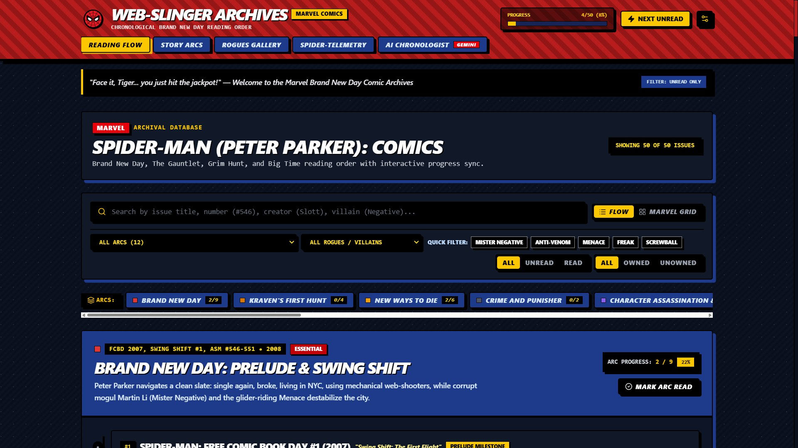

<div align="center">


# THE WEB-SLINGER ARCHIVES 🕸️
*“With great reading order comes great responsibility.”*

[Launch Live App](https://webslingerarchives.vercel.app) · [Report Bug](https://github.com/mhdhamka/webslingerarchives/issues) · [Request Feature](https://github.com/mhdhamka/webslingerarchives/issues)


</div>

---

## What is this?

Tired of getting lost trying to read Marvel's massive eras like **Brand New Day**, **The Gauntlet**, and **Grim Hunt**? 

**The Web-Slinger Archives** is a fully interactive, retro-styled web app built for Web-Heads who want to track their comic reading progression without losing their minds. It features custom comic borders, dynamic suit themes, and an integrated **Gemini 2.5 AI Chronologist** to answer your most unhinged timeline questions!

---

## Interactive Preview & Features



* **Comic Book Aesthetic Layout:** Heavy borders, drop shadows, and high-energy retro styling.
* **Gemini AI Chronologist:** Ask things like *"Where should I read right after One More Day?"* and get instant lore breakdowns.
* **Live Progress Tracking:** Watch your progress bar update in real-time as you check off issues.

---

## Tech Stack

| Category | Technology & Specification |
| :--- | :--- |
| **Frontend** | React + Vite (Blazing fast) |
| **Styling** | Tailwind CSS (Custom Comic Utilities & Brutalist Shadows) |
| **Icons** | Lucide React & Custom Web-Slinger Assets |
| **Brain** | Google Gemini 2.5 API |

---

## Quick Start (Swing Into Action)

Clone the repo and boot up your local server in seconds:

```bash
# 1. Clone the repository
git clone https://github.com/mhdhamka/webslingerarchives.git
cd webslingerarchives

# 2. Install dependencies
npm install

# 3. Set up your secret AI key
echo "GEMINI_API_KEY=your_actual_api_key_here" > .env.local

# 4. Launch the web-slinger workspace!
npm run dev

```

Open **`http://localhost:3000`** in your browser and hit the jackpot, Tiger! 🕸️

---

*Developed with 🔴 and 🔵 by [mhdhamka*](https://github.com/mhdhamka)

If this repo saved you from continuity hell, drop a star! 
